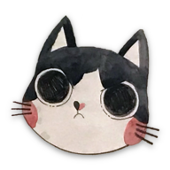

# Cat Waterer

Software to run a pump to give my cat water on demand.

Art by [Shelley Couvillion][shelley]

## Quickstart

TBD

## Building

TBD

## Code of Conduct

We are committed to fostering an open and welcoming environment. Please read our [code of conduct](CODE_OF_CONDUCT.md) before participating in or contributing to this project.

## Contributing

We welcome contributions and collaboration on this project. Please read our [contributor's guide](CONTRIBUTING.md) to understand how best to work with us.

## License and Authors

[ Daniel James](https://github.com/syncromatics)

This software is made available by Daniel James under the MIT license, with the exception of the "Grumpy Rufus" art by [Shelley Couvillion][shelley] under the [CC BY-NC 3.0 license](https://creativecommons.org/licenses/by-nc/3.0/).

[shelley]: https://shelleycouvillion.com/
